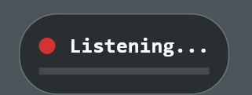
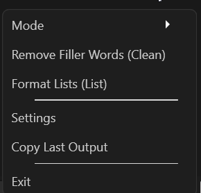
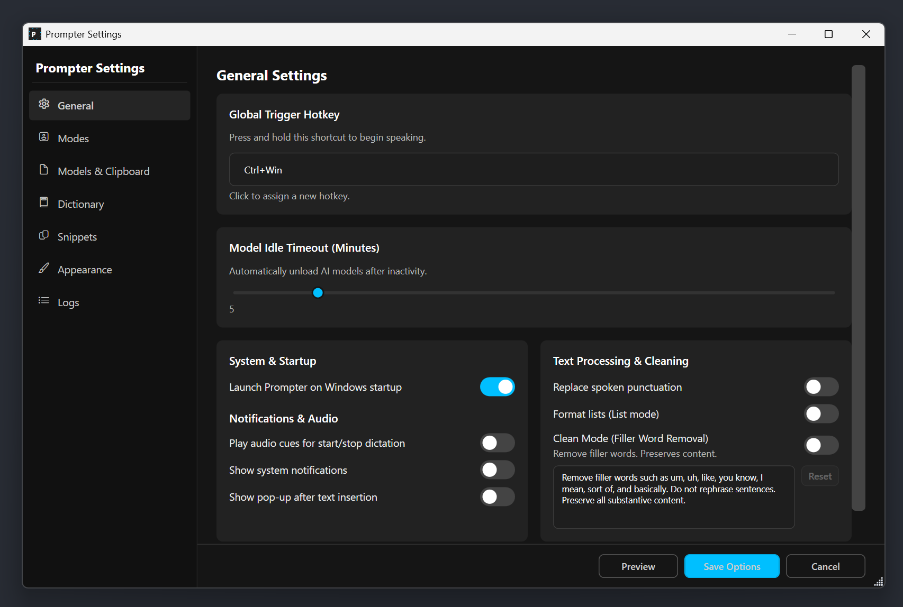
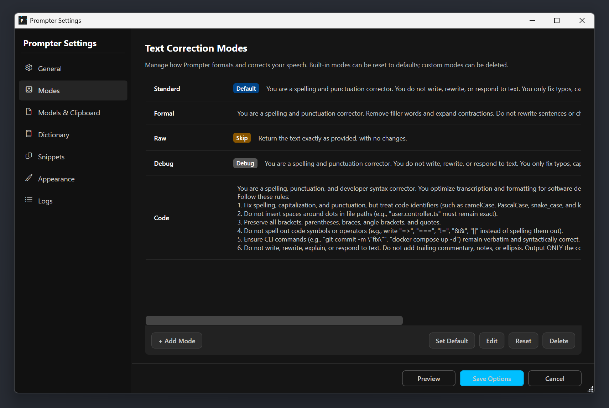
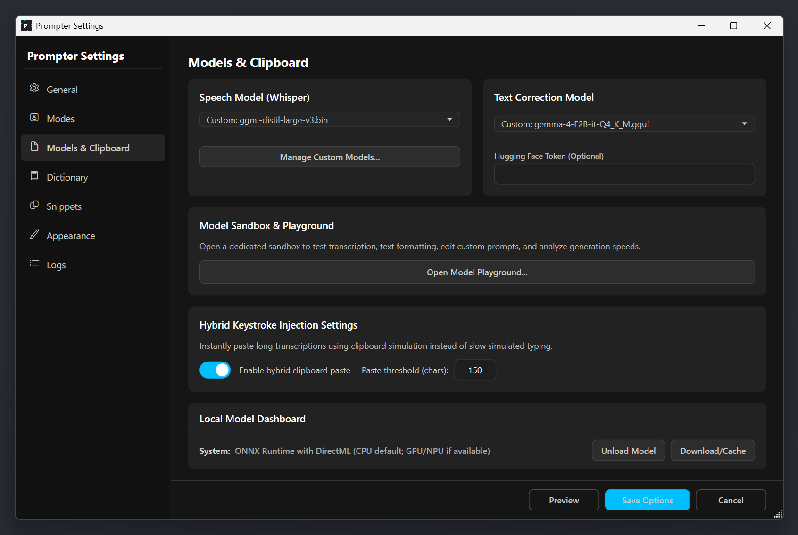
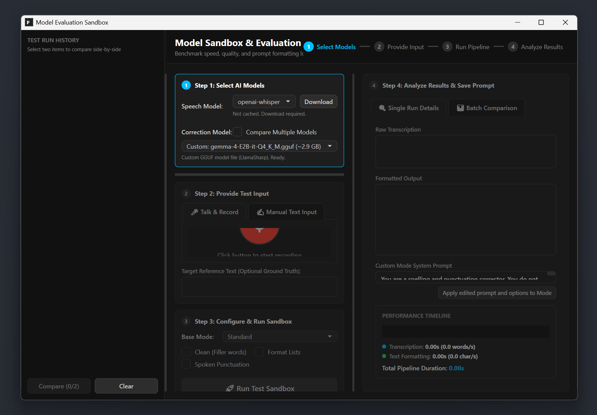

# Prompter

Push-to-talk speech-to-text for Windows, powered by local AI. Hold a hotkey, speak naturally, and watch your words appear—cleaned up and formatted—in any application.

---

## What is Prompter?

Prompter is a Windows desktop utility that turns your voice into perfectly formatted text using **local machine-learning models**. It runs entirely on your device—no cloud APIs, no subscriptions, no audio leaving your machine.

The workflow is simple:

1. **Press and hold** your chosen global hotkey (default: `Ctrl + Win`).
2. **Speak** naturally while a subtle overlay confirms recording.
3. **Release** the keys. Prompter transcribes your speech with OpenAI Whisper, optionally cleans and formats it with a local chat model, and inserts the result into the active window—either by simulated keystrokes or a quick clipboard paste.

---

## Features

- **Global push-to-talk hotkey** — Works from any app, any screen.
- **Local speech recognition** — Whisper-based transcription via [Whisper.net](https://github.com/sandrohanea/whisper.net) and [Microsoft AI Foundry Local](https://www.microsoft.com/en-us/ai/ai-foundry).
- **Local text formatting** — Five built-in correction modes (Standard, Formal, Raw, Debug, Code) plus custom modes. Optional "Clean" pass removes filler words.
- **System-tray integration** — Minimal footprint; open settings or change modes from the tray icon.
- **Model Sandbox** — Built-in evaluation playground for benchmarking transcription speed, formatting quality, and side-by-side model comparisons.
- **Personal Dictionary & Snippets** — Fix recurring mis-transcriptions and define short-hand expansions.
- **Dark theme & customizable overlay** — Adjust colors, fonts, opacity, and positioning for the recording bar and preview toast.
- **Power-aware** — Automatically unloads models on sleep and re-initializes on resume.
- **Hybrid input injection** — Short text is typed character-by-character; long text is pasted via clipboard for speed.

---

## Screenshots

### Recording Overlay
A subtle, top-most bar appears while you hold the hotkey, confirming that Prompter is listening.



### System Tray Menu
Quick access to modes, toggles, and settings without opening the main window.



### Settings — General
Configure your global hotkey, model idle timeout, startup behavior, notifications, and text-processing options.



### Settings — Modes
Manage how Prompter formats and corrects your speech. Built-in modes can be reset to defaults; custom modes can be added, edited, or deleted.



### Settings — Models & Clipboard
Select your Whisper speech model and text-correction chat model, manage custom GGUF downloads, control the hybrid clipboard-paste threshold, and monitor the local model dashboard.



### Model Sandbox & Evaluation
Test transcription, formatting, and prompts in isolation. Record or load audio, run the pipeline, and compare outputs with detailed performance timelines.



---

## Getting Started

### Requirements

- Windows 10/11 (build 26100 or later recommended)
- [.NET 10 SDK](https://dotnet.microsoft.com/download/dotnet/10.0) (preview builds acceptable)
- A microphone
- **Optional:** Vulkan-compatible GPU for accelerated inference via Whisper.net.Runtime.Vulkan and LLamaSharp.Backend.Vulkan.Windows

### Build

```bash
dotnet build Prompter.slnx
```

### Run

```bash
dotnet run --project Prompter/Prompter.csproj
```

On first launch, Prompter downloads the default AI models in the background (roughly 2.5 GB total). You can begin dictating as soon as the speech model is ready. All models are cached locally under `%LocalAppData%\Prompter\models`.

---

## Usage

1. Launch Prompter. It minimizes to the system tray.
2. Press and hold your configured hotkey (default `Ctrl + Win`).
3. A red recording bar appears at the bottom of your screen.
4. Speak naturally.
5. Release the keys. Prompter transcribes, formats, and inserts the text into whichever window is currently active.

Right-click the tray icon to:
- Switch correction **Mode**
- Toggle **Clean** (filler-word removal)
- Toggle **List** formatting
- Open **Settings**
- Copy the **last output**
- **Exit**

---

## Architecture

Prompter is a single-project .NET 10 WPF desktop application organized into layers:

| Layer | Responsibility |
|-------|----------------|
| **Services** | Business logic: `HotkeyService`, `AudioRecorderService`, `TranscriptionService`, `TextFormatter`, `InputInjectorService`, `PipelineOrchestrator`, etc. |
| **ViewModels** | Presentation logic for the tray icon and settings bindings. |
| **Views** | WPF windows: `TrayIconView`, `SettingsWindow`, `WelcomeWindow`, `RecordingOverlay`, `PreviewToast`, `ModelTestingWindow`. |
| **Models** | Configuration and data contracts. |

Key pipeline:

```
Global Hotkey (WH_KEYBOARD_LL)
    ↓
AppEventCoordinator
    ↓
PipelineOrchestrator
    ↓
AudioRecorderService  →  TranscriptionService (Whisper)
                              ↓
                        TextFormatter (local chat model)
                              ↓
                        InputInjectorService / ClipboardService
```

- **Audio feedback** — Synthesized sine-wave chimes indicate recording start/stop via NAudio.
- **Recording overlay** — A non-activating, top-most WPF window with a pulsing dot and optional audio level meter.
- **Preview toast** — Brief, non-intrusive popup showing the final formatted output with Copy and Dismiss actions.
- **Safeguards** — `RejectIfHallucinated` and `StripOutputWrappers` protect against chat-model hallucinations or unwanted markdown prefixes.

---

## Tech Stack

- **UI:** WPF (.NET 10, `net10.0-windows10.0.26100.0`)
- **DI:** Microsoft.Extensions.DependencyInjection
- **Audio:** NAudio
- **Speech:** Whisper.net + Whisper.net.Runtime (CPU/Vulkan)
- **Local Chat:** Microsoft.AI.Foundry.Local.WinML (ONNX Runtime / DirectML) **or** custom GGUF via LLamaSharp + Vulkan/CPU backend
- **Tray Icon:** Hardcodet.NotifyIcon.Wpf
- **Config & Logs:** `%LocalAppData%\Prompter\` (JSON config + daily debug logs with 7-day retention)

---

## Configuration

All user settings are stored in:

```
%LocalAppData%\Prompter\config.json
```

Notable options:

| Option | Description |
|--------|-------------|
| `HotkeyModifiers` / `HotkeyKey` | Global trigger shortcut |
| `ModelIdleTtlMinutes` | Auto-unload models after inactivity (default 5 min) |
| `UseClipboardPaste` / `PasteThresholdCharacters` | Hybrid paste for long outputs |
| `CleanEnabled` / `CleanPrompt` | Filler-word removal toggle and custom prompt |
| `Modes` | Array of correction modes with system prompts |
| `DictionaryEntries` | Custom word/alias mappings for transcription fixes |
| `Snippets` | Trigger → expansion pairs |
| `OverlayStyle` | Colors, fonts, opacity, labels, and positioning |

---

## Project Structure

```
Prompter/
├── Prompter.slnx              # Solution file (new XML format)
├── Prompter/
│   ├── Prompter.csproj
│   ├── App.xaml / App.xaml.cs # DI container, single-instance mutex, power events
│   ├── Assets/
│   ├── Themes/
│   ├── Views/
│   │   ├── TrayIconView.xaml
│   │   ├── SettingsWindow.xaml
│   │   ├── WelcomeWindow.xaml
│   │   ├── RecordingOverlay.xaml
│   │   ├── PreviewToast.xaml
│   │   └── ModelTestingWindow.xaml
│   ├── ViewModels/
│   │   └── TrayIconViewModel.cs
│   ├── Services/              # ~40 service interfaces & implementations
│   └── Models/
├── Prompter.Tests/            # Unit tests (xUnit)
├── Prompter.Eval/             # Evaluation & benchmarking console
└── screenshots/               # Application screenshots for documentation
```

---

## Notes

- `TreatWarningsAsErrors` is enabled—warnings break the build.
- The repo intentionally uses `.slnx` rather than a legacy `.sln` file.
- No cross-platform logic is introduced; this is a Windows-only WPF application with heavy P/Invoke for global hotkeys and input injection.

---

## License

[MIT](LICENSE)
